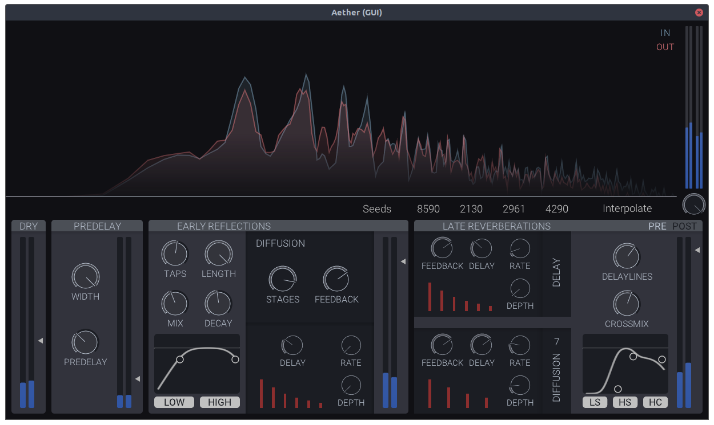

# Aether

[](https://github.com/Dougal-s/Aether/actions/workflows/build.yml?query=branch%3Amaster)



Aether is an algorithmic reverb LV2 plugin based on [Cloudseed](https://github.com/ValdemarOrn/CloudSeed).

## Contents
* [Building](#Building)
	* [Dependencies](#dependencies)
	* [Compiling](#compiling)
	* [Additional Options](#additional-options)

## Building

### Dependencies

**Build Tools**

| Tool  | Version |
| ----- | ------- |
| CMake | >= 3.10 |

**Compiler**

| Compiler | Version |
| -------- | ------- |
| g++      | >=9.0  |
| clang++  | >=10.0  |
| AppleClang  | >=12.0  |

**Libraries**

| Library | Deb Package  |
| ------- | ------------ |
| Lv2     | `lv2-dev`    |
| X11     | `libx11-dev` |
| OpenGL  | `libgl1-mesa-dev` `libglu1-mesa-dev` |

**Ubuntu/Debian**
```bash
sudo apt install cmake g++-10 lv2-dev libx11-dev libgl1-mesa-dev libglu1-mesa-dev
```

**MacOS**
```bash
brew install cmake lv2
```

### Compiling

First clone the repository using:
```bash
git clone --recurse-submodules -j4 https://github.com/Dougal-s/Aether.git
cd Aether
```
Then create the build directory and compile the plugin using:
```bash
mkdir build && cd build
cmake .. -DCMAKE_BUILD_TYPE="Release"
make -j4
```

> Some systems may default to an older version of the compiler causing compilation errors. To fix this, clear the build directory and then run `cmake ..` with the `CXX` environment variable set to the newer compiler (e.g. `g++-10` or `clang++-10`)

### Additional Options

| Option      | Description | Values   |
| ----------- | ----------- | -------- |
| BUILD_TESTS | Build unit tests. The tests can be run using `make test` and individual tests can be found in `builds/tests/tests`. | `on` / `off` |
| BUILD_BENCHMARKS | Build benchmarks. The benchmarks can be run using `make test` and individual benchmarks can be found in `builds/tests/benchmarks`. | `on` / `off` |
| CMAKE_BUILD_TYPE | Debug adds runtime checks and debug information. Release enables additional optimizations. Can also be set using the `--config` flag when running cmake.  | `debug` / `release` |
