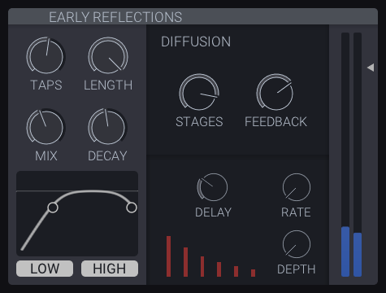

# Aether - User Manual

For a more technical overview of the plugin architecture, please refer to the Cloudseed documentation:
https://github.com/ValdemarOrn/CloudSeed/tree/master/Documentation

## Contents

1. [Main Signal Path](#main-signal-path)  
	1.1. [Dry & Predelay](#dry--predelay)  
	1.2. [Early Reflections](#early-reflections)  
	1.3. [Late Reverberations](#late-reverberations)  
2. [Seeds](#seeds)
3. [Misc Controls](#misc-controls)  
	3.1. [Interpolate](#interpolate)  
	3.2. [Dry/Wet](#drywet)  
	3.3. [Saturation](#saturation)  
5. [Spectrum  Analyser](#spectrum-analyser)
6. [Control Behaviour](#control-behaviour)

## Main Signal Path

### Dry & Predelay

* **Dry level** - Level of the unprocessed dry signal sent to the plugin output.

* **Width** - Stereo width of the audio before being processed by the reverb, with 0% width resulting in a completely mono signal, and 100% width resulting in the original stereo signal.
* **Predelay** - Delay before the onset of the reverb. This plays a part in determining the perceived size of the space created by the reverb.
* **Predelay Level** - Level of the predelayed signal sent to the plugin output.

### Early Reflections

Signal Path: Filters -> Multitap Delay -> Allpass Diffuser

#### Filters

The filters section is composed of a 6db/Oct lowpass and highpass filter that can be toggled on and off using the low/high buttons below the graph.

#### Multitap Delay

The multitap delay is made up of up to fifty randomized single tap delays in parallel.

* **Taps** - Number of tap delays in the multitap delay.
* **Length** - The delay length of the longest tap delay.
* **Mix** - Mixes the dry signal in with the processed output.
* **Decay** - A exponential decay is applied to the tap gains, resulting in taps with longer delays being quieter than taps with shorter decays. The decay control sets the rate of decay, where a decay of 0 results in no decay, while while a decay of 1 applies the maximum decay.

#### Allpass Diffuser

The allpass diffuser is made up of up to 8 allpass filters in series, each with slightly randomized delays and modulation.
* **Stages** - Number of series allpass filters.
* **Feedback** - Allpass filter feedback.
* **Delay** - Average allpass filter delay.

**Modulation**: Modulation adds movement and a chorusing effect, which can reduce any resonances in the reverb.
* **Rate** - Average delay modulation rate.
* **Depth** - Average delay modulation depth.

#### Level Meter

* **Early Reflections Level** - Level of the early reflections signal sent to the output.

### Late Reverberations

The late reverberations are composed of up to 12 delay lines per stereo channel, each made up of a feedback loop containing a modulated delay, allpass diffuser, and a set of filters.

* **Delay Lines** - Number of independent delay lines.
* **Crossmix** - How similar randomized values are across the left and right channels. Low crossmix values will generate wider sounding reverbs while high crossmix values will generate more mono tails. **Note**: *Also affects early reverberations*
* **Order** - The ordering of components in the late reverberations signal path.
* **Late Reverberations Level** - Level of the late reverberations signal sent to the plugin output.

Signal Path:  
  Order Pre: ... -> Modulated Delay -> Output -> Allpass Diffuser -> Filters -> ...  
  Order Post: ... -> Allpass Diffuser -> Output -> Modulated Delay -> Filters -> ...

#### Modulated Delay
The modulated delay is a simple delay with feedback and a delay time modulated by a sin wave. Each delay line has one with slightly randomized delays and modulation to provide variation between delay lines.

* **Feedback** - Average modulated delay feedback. **Note**: *The feedback is not directly randomized, instead it is adjusted based on the randomized delay, so that every delay line will decay at around the same rate.*
* **Delay** - Average modulated delay delay length.

**Modulation**: Similarly to the diffuser modulation, the delay modulation adds movement and a chorusing effect, which can reduce any resonances in the reverb.
* **Rate** - Average delay modulation rate.
* **Depth** - Average delay modulation depth.

#### Allpass Diffuser
The allpass diffuser is identical to the early reflections allpass diffuser.

#### Filters

The filter module is composed of a lowshelf, highshelf and highcut filter, which control the decay rate of the late reverberation. It can be used to dampen high frequencies to create darker reverbs, or to reduce low end rumble in the reverb tail.

## Seeds

From left to right:
* **Early Multitap Seed** - rng seed randomizing tap delays and gains in the Multitap Delay.
* **Early Diffusion Seed** - rng seed randomizing allpass delay, mod depth and mod rate in the early reflections allpass diffuser.
* **Late Delay Seed** - rng seed randomizing the late reverberations modulated delay's delay length, mod depth and mod rate.
* **Late Diffusion Seed** - rng seed randomizing allpass delay, mod depth and mod rate in the late reverberations allpass diffuser.

## Misc Controls

### Interpolate

* **Interpolate** - When disabled, allpass delay lengths are snapped to the nearest sample, creating a white noise like sound when the delay is modulated. When enabled, the delay length is smoothly interpolated between samples resulting in a cleaner sounding reverb.
	**Note**: *Only affects late reverberations allpass diffuser.*

### Dry/Wet

* **Dry/Wet** - Mixes in the original dry signal into the plugin output.

### Saturation

* **Early Diffusion Saturation** - Saturates the signal inside the early reflections allpass filter's feedback loop. Most audible when the feedback is set to 0dB with 8 stages.
* **Late Diffusion Saturation** - Saturates the signal inside the late reverberations allpass filter's feedback loop. Most audible when the feedback is set to 0dB with 8 stages.

**Note:** *The saturation controls have yet to be added to the user interface, and so are only accessible via the plugin host.*

## Spectrum Analyser

* **IN** - Toggles the input spectrum visibility
* **OUT** - Toggles the output spectrum visibility

When only one source is enabled, the analyser will display both the left and right channels of that source.

## Control Behaviour

All the sliders/dials can be adjusted by clicking and dragging or scrolling up/right to increase and down/left to decrease.

Hold `Ctrl` while dragging any slider/dial to fine tune it's value. (Also works with scrolling)
`Shift-click` any slider/dial to reset it to it's default value.
